# Acortador de Enlaces Reactivo con Redis 


Este es un proyecto de portafolio de alto nivel desarrollado con **Java 21** y **Quarkus 3.15.1**. Su objetivo es demostrar una implementación avanzada y representativa de **Redis** utilizando múltiples estructuras de datos nativas.

El sistema sigue los principios de **Clean Architecture** (Arquitectura Limpia) para desacoplar completamente las reglas del negocio de los frameworks y la base de datos Redis. Todo el código, comentarios y documentación están escritos en **español**.

> **Nota Importante:** Para simplificar la ejecución local, la aplicación cuenta con un **servidor de Redis embebido en memoria** que se inicia de forma automática en perfiles de desarrollo o pruebas. De este modo, la aplicación funciona de forma autónoma sin requerir instalaciones externas de bases de datos.

---

## Stack Tecnológico

*   **Java JDK 21** - Aprovechando las últimas características del lenguaje.
*   **Quarkus 3.15.1** - Framework Java reactivo, ágil y de alto rendimiento.
*   **Quarkus Redis Client** - Conector oficial reactivo basado en Vert.x para comunicarse con Redis de manera no bloqueante.
*   **RESTEasy Reactive (Jackson)** - API REST no bloqueante rápida con soporte de Server-Sent Events (SSE).
*   **HTML5 / CSS3 / Vanilla JS** - Dashboard interactivo integrado con estética premium en modo oscuro (índigo, ciruela y lavanda) y modo claro (tonos verdes salvia y beige), glassmorphism y micro-animaciones.

---

## Estructura de Clean Architecture

El proyecto divide sus componentes para asegurar que el núcleo de negocio sea independiente de Redis y Quarkus:

*   `dominio`: Contiene las entidades puras de negocio (`Enlace`, `Analitica`), excepciones de dominio y las interfaces de los puertos de salida (`EnlaceRepositorioPort`, `AnaliticasRepositorioPort`). No tiene dependencias de librerías ni de frameworks.
*   `aplicacion`: Implementa la lógica de negocio y los casos de uso (`AcortarUrlUseCase`, `ObtenerAnaliticasUseCase`) a través de servicios en Java puro.
*   `infraestructura`: Contiene las implementaciones técnicas concretas.
    *   `adaptadores/redis`: Conecta los puertos de dominio con Redis utilizando el cliente oficial.
    *   `adaptadores/rest`: Expone los controladores REST, redirecciones y el canal SSE para el dashboard.
    *   `configuracion`: Cablea los beans de aplicación mediante CDI y expone el filtro interceptor de Rate Limiting y el servidor Redis embebido.

### Diagrama de Clases

El siguiente diagrama representa la estructura de clases del proyecto y su alineación con Clean Architecture:

```mermaid
classDiagram
    direction BT

    class Enlace {
        -String codigo
        -String urlOriginal
        -Long tiempoVidaSegundos
        -LocalDateTime fechaCreacion
        +tieneExpiracion() boolean
    }

    class Analitica {
        -String codigo
        -long clicsTotales
        -Map~String, Long~ clicsPorNavegador
    }

    class EnlaceRepositorioPort {
        <<interface>>
        +guardar(Enlace enlace) void
        +obtenerPorCodigo(String codigo) Optional~Enlace~
        +existeCodigo(String codigo) boolean
    }

    class AnaliticasRepositorioPort {
        <<interface>>
        +registrarClic(String codigo, String navegador) void
        +obtenerAnaliticas(String codigo) Analitica
        +obtenerRankingPopularidad(int limite) Map~String, Long~
        +publicarActividadClic(String codigo, String urlOriginal, String navegador) void
    }

    class AcortarUrlUseCase {
        <<interface>>
        +acortar(String urlOriginal, Long tiempoVidaSegundos) Enlace
        +obtenerUrlOriginal(String codigo, String navegador) String
    }

    class ObtenerAnaliticasUseCase {
        <<interface>>
        +consultar(String codigo) Analitica
        +consultarRanking(int limite) Map~String, Long~
    }

    class AcortarUrlService {
        -EnlaceRepositorioPort enlaceRepo
        -AnaliticasRepositorioPort analiticasRepo
        +acortar(String urlOriginal, Long tiempoVidaSegundos) Enlace
        +obtenerUrlOriginal(String codigo, String navegador) String
    }

    class ObtenerAnaliticasService {
        -AnaliticasRepositorioPort analiticasRepo
        +consultar(String codigo) Analitica
        +consultarRanking(int limite) Map~String, Long~
    }

    class RedisEnlaceAdapter {
        -ValueCommands~String, String~ comandosValor
        -KeyCommands~String~ comandosClave
        +guardar(Enlace enlace) void
        +obtenerPorCodigo(String codigo) Optional~Enlace~
        +existeCodigo(String codigo) boolean
    }

    class RedisAnaliticasAdapter {
        -HashCommands~String, String, Long~ comandosHash
        -SortedSetCommands~String, String~ comandosZSet
        -PubSubCommands~String~ comandosPubSub
        +registrarClic(String codigo, String navegador) void
        +obtenerAnaliticas(String codigo) Analitica
        +obtenerRankingPopularidad(int limite) Map~String, Long~
        +publicarActividadClic(String codigo, String urlOriginal, String navegador) void
    }

    class RedisPubSubAdapter {
        -ReactivePubSubCommands~String~ pubsubReactivo
        +escucharActividad() Multi~String~
    }

    class EnlaceResource {
        -AcortarUrlUseCase acortarUseCase
        -ObtenerAnaliticasUseCase analiticasUseCase
        +crear(CrearEnlaceRequest peticion) Response
        +obtenerAnaliticas(String codigo) Response
        +obtenerRanking(int limite) Response
    }

    class RedireccionResource {
        -AcortarUrlUseCase acortarUseCase
        +redireccionar(String codigo, String userAgent) Response
        -identificarNavegador(String userAgent) String
    }

    class StreamResource {
        -RedisPubSubAdapter pubsubAdapter
        +transmitirClicsEnVivo() Multi~String~
    }

    class LimitadorTasaFilter {
        -ValueCommands~String, Long~ comandosValor
        -KeyCommands~String~ comandosClave
        +interceptarPeticion(ContainerRequestContext contexto) Response
    }

    AcortarUrlService ..|> AcortarUrlUseCase
    ObtenerAnaliticasService ..|> ObtenerAnaliticasUseCase

    AcortarUrlService --> EnlaceRepositorioPort
    AcortarUrlService --> AnaliticasRepositorioPort
    ObtenerAnaliticasService --> AnaliticasRepositorioPort

    RedisEnlaceAdapter ..|> EnlaceRepositorioPort
    RedisAnaliticasAdapter ..|> AnaliticasRepositorioPort

    EnlaceResource --> AcortarUrlUseCase
    EnlaceResource --> ObtenerAnaliticasUseCase
    RedireccionResource --> AcortarUrlUseCase
    StreamResource --> RedisPubSubAdapter
```



---

## Implementación de Estructuras en Redis

Este proyecto destaca por no usar Redis únicamente como una memoria caché genérica, sino utilizando sus estructuras de datos óptimas para cada tarea:

1.  **Strings (Clave-Valor) con Expiración**:
    *   **Estructura**: Clave `enlace:{codigo}` -> Valor `urlOriginal`.
    *   **Uso**: Permite una redirección ultra rápida en tiempo $O(1)$. Soporta expiración dinámica mediante TTL (`EXPIRE`), haciendo que los enlaces temporales se autodestruyan.
2.  **Hashes**:
    *   **Estructura**: Clave `enlace:{codigo}:analiticas` -> Mapa de campos (`total`, `chrome`, `firefox`, `safari`, `edge`, `otros`).
    *   **Uso**: Registra y agrupa las métricas detalladas por navegador para cada enlace acortado. Los contadores se incrementan atómicamente con `HINCRBY`.
3.  **Sorted Sets (Conjuntos Ordenados - ZSets)**:
    *   **Estructura**: Clave `enlaces:ranking` -> Elementos `codigo` ordenados por su cantidad de clics.
    *   **Uso**: Cada clic incrementa el score del código usando `ZINCRBY`. El endpoint `/api/enlaces/ranking` recupera instantáneamente el "Top 5" de enlaces más visitados de forma eficiente.
4.  **Strings con TTL (Rate Limiter)**:
    *   **Estructura**: Clave `limite:ip:{ip}` -> Contador entero con TTL de 60 segundos.
    *   **Uso**: Protege la API de abusos. Si una IP realiza más de 5 peticiones de acortamiento en menos de un minuto, el filtro HTTP intercepta la solicitud y devuelve un código `429 Too Many Requests`.
5.  **Pub/Sub (Publicación/Suscripción)**:
    *   **Estructura**: Canal `enlaces:actividad`.
    *   **Uso**: Cada redirección publica un mensaje JSON en el canal de Redis. El backend consume este canal de forma reactiva y transmite los clics en tiempo real al dashboard a través de Server-Sent Events (SSE).

### Resumen de la Estructura de Datos

| Estructura | Nombre/Clave | Descripción |
| :--- | :--- | :--- |
| **String** | `enlace:{codigo}` | Guarda la URL de destino asociada al código generado. Soporta expiración. |
| **Hash** | `enlace:{codigo}:analiticas` | Guarda los campos `total`, `chrome`, `firefox`, `safari`, `edge` y `otros` con sus clics. |
| **Sorted Set** | `enlaces:ranking` | Almacena los códigos como miembros ordenados según sus clics totales (score). |
| **String** | `limite:ip:{ip}` | Contador temporal de peticiones por dirección IP para la limitación de tasa. |
| **Canal Pub/Sub** | `enlaces:actividad` | Canal para difundir eventos de clic asíncronamente y alimentar el flujo SSE. |

---

## Cómo Ejecutar el Proyecto

### 1. Levantar el Servidor Redis
Puedes utilizar el servidor de Redis de dos maneras:

*   **Opción A (Recomendada / Automática)**: No necesitas realizar ninguna instalación. El proyecto cuenta con un servidor de Redis embebido. Al iniciar la aplicación en modo desarrollo o correr las pruebas, este levantará en memoria un servidor en el puerto `6379` de forma automática.
*   **Opción B (Servidor Externo)**: Si prefieres usar una instancia externa de Redis (ej. Docker, Memurai, WSL2), asegúrate de tenerla activa en el puerto `6379`. Por ejemplo, usando Docker:
    ```bash
    docker run --name redis-local -p 6379:6379 -d redis
    ```
    *Nota: Si la aplicación detecta el puerto `6379` ocupado, omitirá levantar el Redis embebido y se conectará directamente a tu servidor externo.*

### 2. Iniciar la Aplicación
1. Abre tu terminal en el directorio raíz del proyecto:
   ```bash
   cd acortador-redis
   ```
2. Ejecuta la aplicación en modo desarrollo (Live Coding):
   ```bash
   mvn quarkus:dev
   ```
3. Abre en tu navegador la URL: **[http://localhost:8080](http://localhost:8080)**

### 3. Ejecutar las Pruebas
Para compilar y correr las pruebas de integración utilizando JUnit 5 y RestAssured en un entorno de pruebas limpio:
```bash
mvn test
```

---

## Dashboard Web

La aplicación sirve un panel de control interactivo en la raíz del servidor. Este dashboard cuenta con:
*   **Acortador en tiempo real**: Formulario animado para crear enlaces cortos con TTL.
*   **Simulador de clics**: Botón para probar la redirección y ver la velocidad de respuesta.
*   **Analíticas interactivas**: Gráficos de barras que muestran la distribución por navegador del enlace consultado (Chrome, Firefox, Safari, Edge, Otros).
*   **Top 5 dinámico**: Ranking en tiempo real ordenado automáticamente.
*   **Feed en vivo**: Consola conectada a SSE que muestra cada clic que ocurre en el sistema en tiempo real.
*   **Prueba de Rate Limiting**: Si intentas crear más de 5 enlaces en 60 segundos, verás aparecer una notificación flotante de advertencia animada.
*   **Selector de Tema**: Botón en la parte superior derecha para alternar dinámicamente entre el **Modo Oscuro** (índigo, ciruela y lavanda) y el **Modo Claro** (verde salvia y beige), guardando la preferencia del usuario en su `localStorage`.
